# 作品综述 ｜ 原理 · 创新点 · 结构 · 功能演示

> 答辩 / 路演 / 评委 / 第一次接触本项目的人 —— **从这一份开始**。
> 看完这份能完整 grasp 整个作品；想看深层技术细节再翻其它专题文档。

---

## 0. 一句话介绍

> **基于海思 WS63（LiteOS）+ MPU6050 + Edge Impulse TinyML + 星闪 SLE 的端侧智能跌倒检测与多链路报警系统。**
>
> 老人摔倒 → 200 ms 内本机声光告警 → 1 秒内星闪通知监护人网关 → 同时走 Wi-Fi 推送微信、4G 拨打家属电话、发跌倒短信。
> **全程无云依赖、断网可拨号、误报率低**。

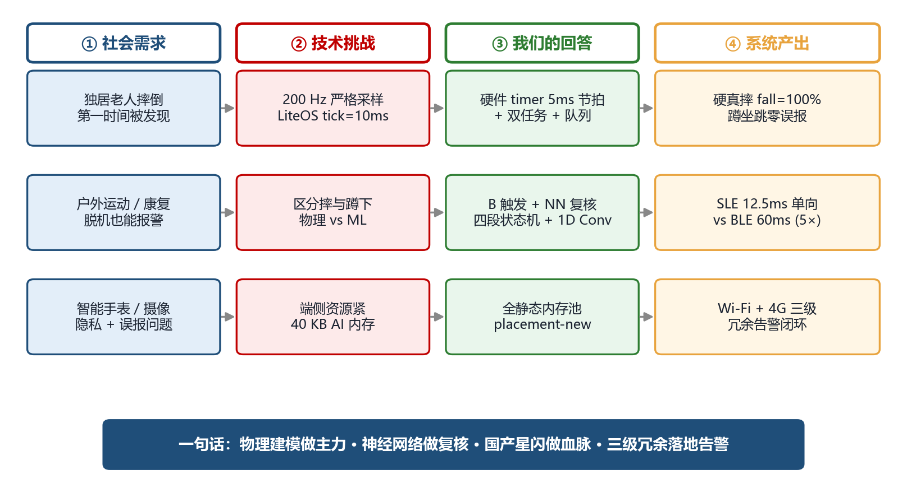

*图 0-1　作品全景。从左到右依次展示：① 我们要解决的社会需求（独居老人摔倒、户外脱机告警、隐私误报）→ ② 对应的技术挑战（200 Hz 严格采样、摔与蹲的物理区分、端侧 40 KB AI 内存）→ ③ 我们的回答（硬件 timer 节拍 + B 触发 + NN 复核 + 全静态内存）→ ④ 量化产出（fall = 100%、误报 0%、SLE 12.5 ms 单向 vs BLE 60 ms、Wi-Fi+4G 三级冗余）。*

---

## 1. 作品介绍：要解决什么问题

### 1.1 现实痛点

中国 60 岁以上人口已超 2.96 亿，独居老人比例持续上升。跌倒是 65 岁以上老人**意外死亡的首位原因**，
而**"摔后无人发现 → 错过 1 小时黄金救援窗口"**是致死率的关键放大器。
现有市售老人手环/腕表存在三大不足：

| 问题 | 现状 | 本作品的解决 |
|------|------|----------|
| **误报率高** | 纯 ML 方案易把"快速坐下/弯腰"误判 | 路径 B 确定性物理判据 + NN 复核两层把关 |
| **强云依赖** | 大多走 4G + 厂商云,断网/欠费即失联 | SLE + Wi-Fi + 4G **三路并行**,任一通即可报警 |
| **续航与功耗** | 持续 4G 待机数小时一充 | 端侧推理 + SLE 低功耗,核心节点全程仅 IMU/MCU 工作 |

### 1.2 目标场景

- 居家独居老人腰间佩戴**手环节点(板 A)**
- 家中/养老院/社区放置**网关节点(板 B)** —— 接 220V 长供电
- 监护人在远端接收 SLE 短距告警 + 微信推送 + 接听 4G 自动外呼电话

### 1.3 核心价值（One Sentence Each）

- **AI 真正落地**：神经网络真正参与判定（不是 demo 摆设），且与确定性算法**互为冗余**
- **国产协议首选**：在比赛规定的 WS63 平台用**星闪 SLE** 作主上行，体现新国标无线生态优先
- **生产级健壮性**：I2C 总线锁死自恢复、MPU6050 掉线自救、看门狗、报警守护任务……不是 demo 风格
- **可商用扩展**：4G DTU + JSON 协议留出云对接、远程语音、GPS/北斗、健康监测扩展路径

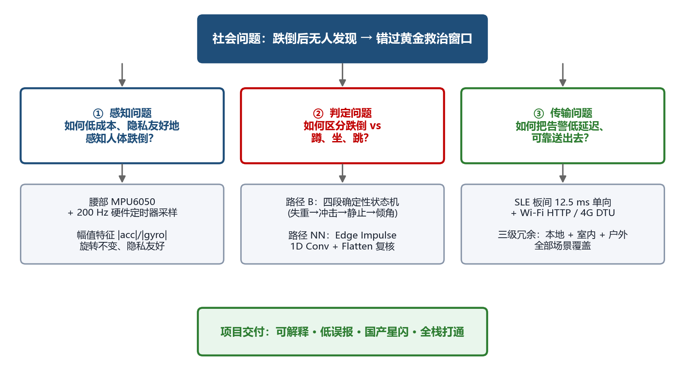

*图 1-1　问题拆解。顶层社会问题"跌倒后无人发现、错过黄金救治窗口"被分解为三个工程子问题：① **感知问题**（如何低成本、隐私友好地感知人体跌倒）→ 腰部 MPU6050 + 200 Hz 硬件定时器采样、用幅值特征做到旋转不变；② **判定问题**（如何区分跌倒 vs 蹲、坐、跳）→ 路径 B 四段确定性状态机 + 路径 NN Edge Impulse 复核；③ **传输问题**（如何低延迟可靠送出告警）→ SLE 板间 12.5 ms 单向 + Wi-Fi/4G 三级冗余。*

---

## 2. 系统结构

### 2.1 整体框图

```
┌─────────────────────────────────────────────────────────────────────────────┐
│                        手环节点 (板 A · WS63 · LiteOS)                       │
│                                                                              │
│   ┌────────────┐  200Hz   ┌──────────────┐  trigger  ┌──────────────────┐    │
│   │  MPU6050   │ ───────► │ Sample 任务  │ ────────► │ 路径 B 状态机    │    │
│   │  6轴 IMU   │ I2C(400k)│ (硬件 timer  │  IMU 队列 │ (fall_algo.c)   │    │
│   │  ±16g/2000 │          │  5ms 精确)   │  深度128  │ 4 道物理判据    │    │
│   └────────────┘          └──────────────┘           └────────┬─────────┘    │
│                                  │ 每样本                        │ status=1   │
│                                  ▼                              ▼           │
│                          ┌──────────────────┐         ┌──────────────────┐  │
│                          │ EI 环形缓冲(3s) │ ───────► │ NN 复核器       │  │
│                          │ |acc|/|gyro| 2ch│  classify│ Edge Impulse    │  │
│                          └──────────────────┘         │ Flatten + Dense │  │
│                                                       └────────┬─────────┘  │
│                                                                │ 否决/同意   │
│                            ┌───────────────────────────────────┘            │
│                            │                                                │
│                            ▼                                                │
│   ┌───────────────────────────────────────────────────────────────────┐    │
│   │  最终判定: B 触发 且 NN 不否决 (normal < 95%) → 报警               │    │
│   └───────────────────────────────────────────────────────────────────┘    │
│                            │                                                │
│              ┌─────────────┴──────────────┐                                 │
│              ▼                            ▼                                 │
│      ┌──────────────┐           ┌────────────────────┐                      │
│      │ WS2812B 红闪 │           │ 星闪 SLE Server    │                      │
│      │ 10s + 蜂鸣   │           │ Notify 0x05        │                      │
│      └──────────────┘           └─────────┬──────────┘                      │
└────────────────────────────────────────────┼────────────────────────────────┘
                                             │ SLE 1.0 短距 (~20m)
                                             ▼
┌─────────────────────────────────────────────────────────────────────────────┐
│                        网关节点 (板 B · WS63 · LiteOS)                       │
│                                                                              │
│   ┌────────────────────┐  收到 0x05    ┌───────────────────────────────┐    │
│   │ 星闪 SLE Client    │ ────────────► │ 三路并行报警分发              │    │
│   │ 扫描+连接+订阅     │ 回复 0x06 ACK └──┬──────┬──────┬──────┬──────┘    │
│   └────────────────────┘                  │      │      │      │            │
│                                           ▼      ▼      ▼      ▼            │
│                              本机 ws2812 蜂鸣 LED   Wi-Fi    4G DTU         │
│                              红闪 5Hz   持续  常亮   HTTP    UART → V100C    │
│                                                    POST     ┌─────────┐    │
│                                                     │       │ LuatOS  │    │
└─────────────────────────────────────────────────────┼───────┤拨号+短信│────┘
                                                      │       └────┬────┘
                            ┌─────────────────────────┘            │
                            ▼                                      │
                    ┌──────────────┐                               │
                    │ Python 后端  │                               │
                    │ (FastAPI)    │                               │
                    └──────┬───────┘                               │
                           │                                       │
                           ▼                                       ▼
                  ┌────────────────┐                  ┌────────────────────┐
                  │ PushPlus 推送  │                  │  家属手机          │
                  │ 微信告警       │                  │  接听电话 + 收短信 │
                  └────────────────┘                  └────────────────────┘
```

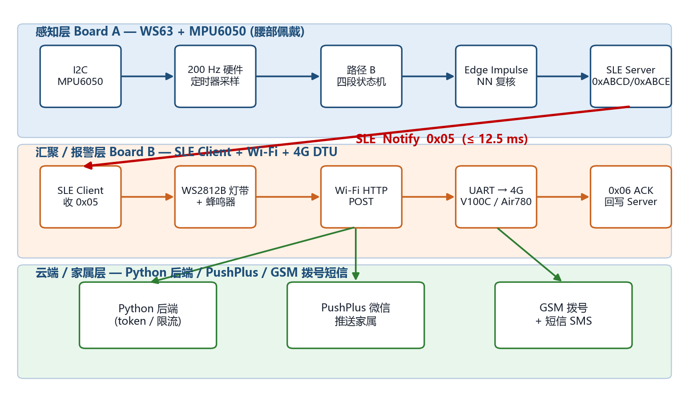

*图 2-1　系统三层架构与端到端链路。上：感知层（板 A · WS63 + MPU6050，腰部佩戴）—— I2C 读取 → 200 Hz 硬件定时器采样 → 路径 B 四段状态机 → Edge Impulse NN 复核 → SLE Server 注册 0xABCD/0xABCE。中：汇聚 / 报警层（板 B · SLE Client + Wi-Fi + 4G DTU）—— 收到板 A 的 SLE Notify 0x05（≤ 12.5 ms）后并行触发 WS2812B 灯带、Wi-Fi HTTP POST、UART → 4G 拨号。下：云端 / 家属层 —— Python 后端 + PushPlus 微信推送 + GSM 拨号短信，全程不强制依赖云。*

### 2.2 板 A（手环节点 · Sensor + AI Node）

| 组件 | 型号/规格 | 接口 |
|------|----------|------|
| MCU | HiSilicon WS63 (RISC-V rv32imfc, 160 MHz) | — |
| IMU | MPU6050 (±16g / ±2000 dps, DLPF 44Hz) | I2C1 SDA=GPIO15 SCL=GPIO16 @400kHz |
| 报警灯 | WS2812B 单总线 RGB 灯带 | GPIO10 |
| 星闪 | 板载 SLE 1.0 射频 | 自带 |
| 电源 | MH-CD42 锂电管理 + 锂电池 | 5V/3.3V 双轨 |

**任务清单 (LiteOS)**：
- `FallTask` (osPriorityNormal) — 跑混合判定主循环
- `ImuSampler` (osPriorityAboveNormal) — 硬件定时器驱动的 200Hz 采样
- `ws2812b_flash_task` — 灯效任务
- 星闪协议栈 + LiteOS 自带任务

### 2.3 板 B（网关节点 · Receiver Gateway）

| 组件 | 型号/规格 | 接口 |
|------|----------|------|
| MCU | HiSilicon WS63 | — |
| Wi-Fi | 板载 2.4GHz | wlan0 |
| 4G 模块 | 银尔达 V100C (Air780EHV，跑 LuatOS) | UART1 TX=GPIO15 RX=GPIO16 @115200 |
| 报警灯 | WS2812B 灯带 | GPIO10 |
| 蜂鸣器 | MH-FMD 有源蜂鸣器 (低电平触发) | GPIO08 |
| 状态 LED | 普通 LED | GPIO09 |

**任务清单**：
- `FallTask` (CLIENT 角色) — 星闪扫描/连接/收通知
- `fall_alert_guard` — 报警守护，到期自动停蜂鸣器
- `fall_alert_gateway` — Wi-Fi 状态机 + HTTP POST
- `fall_alert_4g_dtu` — UART → V100C JSON 推送

### 2.4 通信链路（三路并行）

| # | 链路 | 用途 | 延时 | 断网弹性 |
|---|------|------|------|----------|
| 1 | **SLE 1.0 短距** | 板 A ↔ 板 B 主上行 | < 30 ms | 短距点对点，不依赖任何基础设施 |
| 2 | **Wi-Fi → Python 后端 → PushPlus** | 微信推送（家属手机）| < 2 s | 依赖 2.4G WiFi + 公网 |
| 3 | **4G DTU → V100C → 拨号/短信** | 户外/无 WiFi 兜底 | < 5 s | 仅需移动信号 + 一张 SIM 卡 |

**三路并行**：板 B 收到 0x05 后**同时**触发链路 2 和 3。任一通即"家属已知会"。

### 2.5 软件分层

```
┌─────────────────────────────────────────────────────────────────┐
│  应用层 (我们的代码 ~2500 行 C/C++)                              │
│  main_task / fall_algo / ei_fall / mpu6050 / sle_* / ws2812b /  │
│  fall_alert_gateway / fall_alert_4g_dtu                          │
├─────────────────────────────────────────────────────────────────┤
│  ML 库:  Edge Impulse SDK + TF-Lite Micro (已 -fno-exceptions / │
│          静态内存池 64KB / Wnarrowing 局部抑制)                  │
├─────────────────────────────────────────────────────────────────┤
│  组件层: SLE SSAP / Wi-Fi 驱动 / lwIP / LittleFS / NV ...        │
├─────────────────────────────────────────────────────────────────┤
│  OS:    LiteOS (任务/信号量/队列/timer/osal)                     │
├─────────────────────────────────────────────────────────────────┤
│  HAL:   uapi_i2c / uapi_uart / uapi_timer / uapi_gpio / TCXO    │
├─────────────────────────────────────────────────────────────────┤
│  HW:    WS63 RISC-V + 外设(I2C/SPI/UART/Timer/GPIO/SLE/WiFi)     │
└─────────────────────────────────────────────────────────────────┘
```

---

## 3. 工作原理 —— 一次跌倒从发生到家属收信的完整过程

### 3.1 数据采集：硬件定时器 200Hz 精准节拍

**为什么不能用 `osDelay(5)`**：LiteOS tick 10 ms 分辨率 + 抖动，根本喂不到神经网络要求的恒定 5ms 间隔。
**做法**：硬件 `timer1` 每 5ms 触发中断 → 中断只 `osSemaphoreRelease`（不在中断里读 I2C，I2C 是阻塞调用）
→ 高优先级 `ImuSampler` 任务从信号量醒来 → 读一帧 6 轴 → 入队列。
**结果**：200Hz 采样恒定，推理任务上百 ms 的耗时不会拖慢节拍（中间用深度 128 的队列缓冲）。

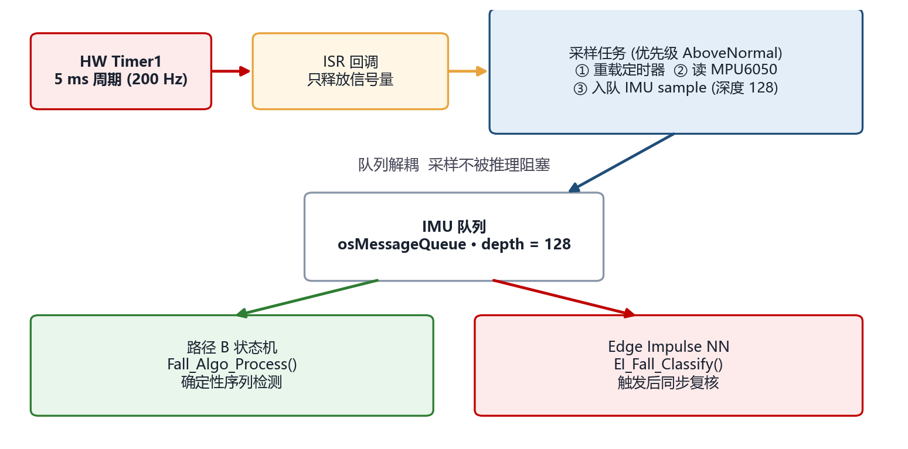

*图 3-A　采样管线时序与解耦结构。`HW Timer1` 5 ms 周期触发 ISR；ISR 只 `osSemaphoreRelease`（不在中断里读 I2C，因为 I2C 是阻塞调用）；高优先级"采样任务"信号量唤醒后做①重载定时器 ②读 MPU6050 ③入队列；推理侧（路径 B 状态机 + Edge Impulse NN）从队列异步取样本。**队列解耦**保证 200 Hz 节拍不被上百 ms 的 NN 推理拖慢，是端侧实时性的关键。*

### 3.2 路径 B：确定性物理判据（fall_algo.c · 主触发）

跌倒有固定的物理特征序列，把这套物理规则编进状态机：

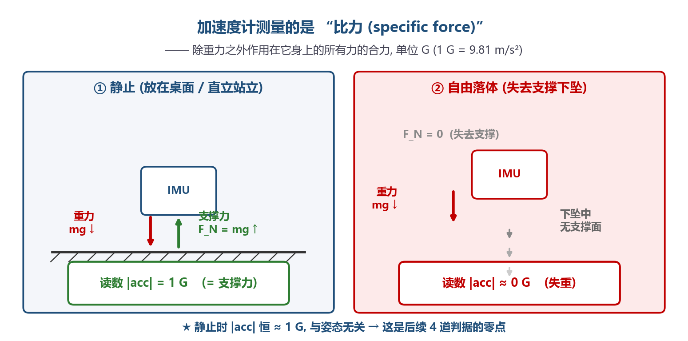

*图 3-1　所有判据的"零点"。加速度计测量的是"比力（specific force）"——除重力以外作用在 IMU 上的力。静止时支撑力 `F_N = mg ↑` 抵消重力，IMU 读出 `|acc| = 1 G`；自由落体瞬间支撑力消失，只剩重力，IMU 读出 `|acc| ≈ 0 G`。这就是判据 ① 失重的物理底座，也是 `FF_ACC_G = 0.75 G` 的物理含义。*

```
IDLE   ──|acc|<0.75G──►   FREEFALL   ──失重>70ms 结束──►   IMPACT_WAIT
                                                              │
                                                       |acc|>2.2G
                                                              ▼
                                                        POST_IMPACT
                                                          │   ┌── 跳 0.5s 翻滚沉降期
                                                          │   └── 再观察 1s 静止
                                                          ▼
                       ┌──────────────────────────────────┴────────────────────────────┐
                       │ 必须四项齐全:                                                 │
                       │  ① 自由落体 |acc|<0.75G 持续 70~750ms                          │
                       │  ② 硬冲击 峰值 ≥4.0G                                          │
                       │  ③ 冲击后 1s 内 ≥50% 样本是静止 (|acc|∈[0.6,1.4]G)             │
                       │  ④ 躯干倾角 ≥45°  (冲击前后重力方向夹角)                       │
                       └──────────────────────────────────┬────────────────────────────┘
                                                          ▼
                                                  return 1 (跌倒)
```

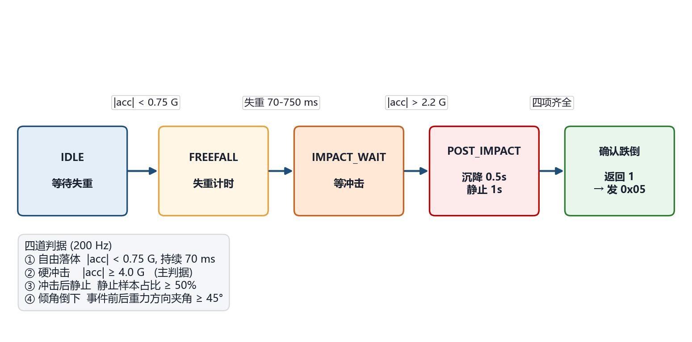

*图 3-1B　路径 B 状态机精炼视图。从 `IDLE` 起步，由 `|acc| < 0.75 G` 进入 `FREEFALL`，失重段 70–750 ms 结束后进入 `IMPACT_WAIT`，`|acc| > 2.2 G` 触发 `POST_IMPACT`（先跳过 0.5 s 翻滚沉降，再统计 1 s 静止），最后**四项判据齐全**才"确认跌倒"返回 1 → 触发 SLE Notify 0x05。底部一栏列出四道判据的阈值与代码常量名，与下方"物理阶段时序图（图 3-2）"互补：本图给出算法宏观视角，图 3-2 给出物理姿态视角。*

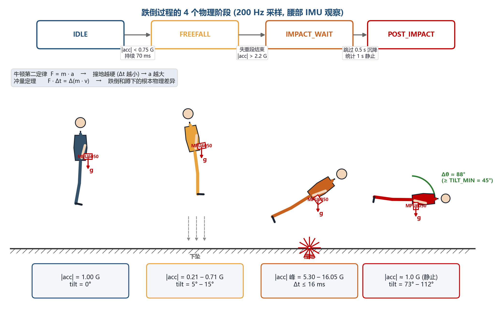

*图 3-2　跌倒在 IMU 视角下的 4 段时序与状态机映射：IDLE（直立、|acc|=1 G、tilt=0°）→ FREEFALL（失重下坠、|acc|=0.21–0.71 G）→ IMPACT_WAIT（失控撞地、冲击峰 5.30–16.05 G、Δt ≤ 16 ms）→ POST_IMPACT（人躺定不动、|acc|≈1 G、tilt 73°–112°）。顶部条带的转移条件 `0.75 G / 2.2 G / 0.5 s+1 s` 与代码常量 `FF_ACC_G / IMPACT_ACC_G / IMPACT_SETTLE+STILL_WINDOW` 一一对应。*

**四项物理判据各自挡住的误报**：

| 判据 | 物理依据 | 不满足时挡住的误报 |
|------|--------|--------------------|
| ① 自由落体 | 跌倒必经"失去支撑"瞬间 \|acc\| 跌破 1G | 轻拿轻放、抖动 |
| ② 硬冲击 ≥4G | 失控撞地刹停 Δt 极短(F=ma)，而蹲下/坐下是肌肉缓冲减速 | 快速蹲下、用力坐下（实测 ≤3.1G） |
| ③ 冲击后静止 | 跌倒后人躺地不动 \|acc\|≈1G | 剧烈摇晃、摔后立刻爬起 |
| ④ 倾角 ≥45° | 躺地后躯干水平，重力方向相对直立时偏转 ~90° | 原地起跳落地（人仍直立） |

**实测带标签数据（最终定阈值的依据）**：

| 动作 | tilt | impact | 路径 B |
|------|------|--------|--------|
| 快速蹲下 | 61~91° | **2.32 / 2.68 / 3.05 G** | ❌ 软冲击被挡 |
| 用力坐下 | 14~30° | ≤2.5 G | ❌ 软冲击 + 躯干直立 双重挡 |
| 原地起跳落地 | 9~20° | 4~6 G | ❌ 躯干仍直立被挡 |
| **真实跌倒** | **73~112°** | **5.30 / 11.57 / 15.62 / 16.05 G** | ✅ CONFIRMED |

→ `impact` 是最干净的物理分界，**4.0 G 落在 3.05 和 5.30 中间**，干净分开"摔"和"蹲"。

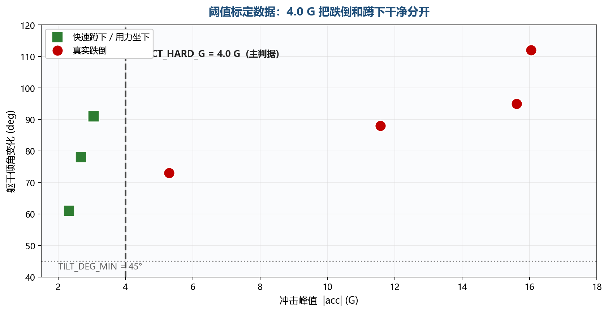

*图 3-2B　实测数据的 2D 阈值视角（横轴：冲击峰值 |acc|，纵轴：躯干倾角变化）。绿色方块为"快速蹲下/用力坐下"实测点（2.32–3.05 G、61°–91°），红色圆点为"真实跌倒"实测点（5.30–16.05 G、73°–112°）。竖虚线 `IMPACT_HARD_G = 4.0 G` 把两类点干净分开；横虚线 `TILT_DEG_MIN = 45°` 给出二级把关。这张散点是判据 ② 阈值选择的直接依据，下方"波形图（图 3-3）"则给出冲击瞬间的时间细节。*

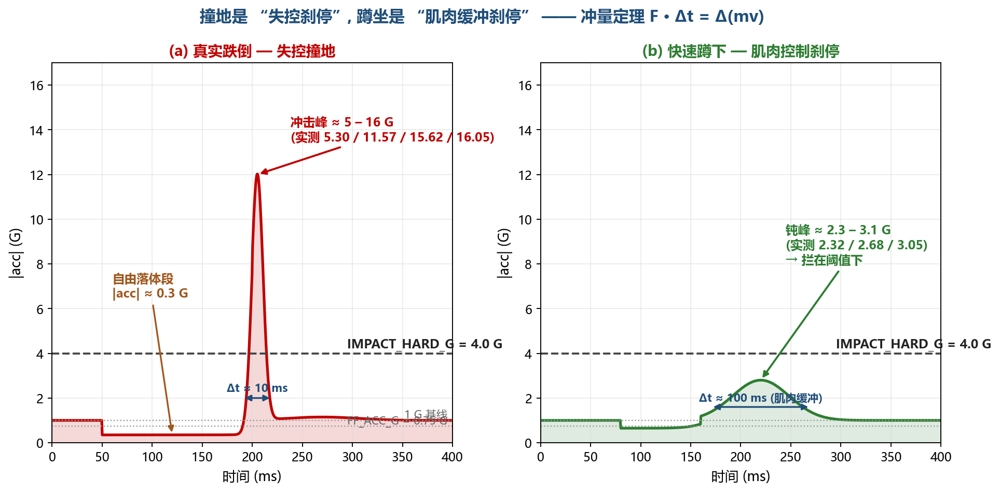

*图 3-3　冲量定理 `F·Δt = Δ(mv)` 在波形上的直接体现，也是判据 ② 的物理根本。左图真实跌倒：失重段下到 0.3 G，撞地在 ~10 ms 内把动量强行归零，冲击峰冲到 5–16 G；右图快速蹲下：腿部肌肉用 ~100 ms 缓冲减速，钝峰只有 2.3–3.1 G。`IMPACT_HARD_G = 4.0 G`（红色虚线）取在两组实测数据中间，干净分开"摔"和"蹲"。*

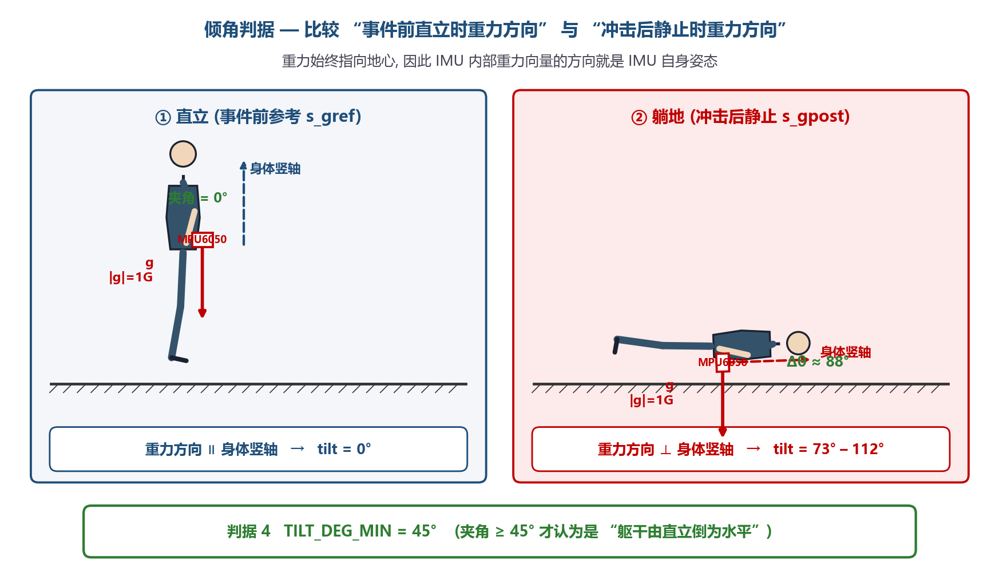

*图 3-4　判据 ④ 倾角的几何含义。重力始终指向地心，IMU 内部观测到的重力向量方向就是 IMU（即躯干）自身姿态：直立时重力与身体竖轴平行（夹角 0°），躺地后重力与身体竖轴近乎垂直（实测 Δθ = 73°–112°）。算法仅比较"事件前 `s_gref`"与"冲击后静止 `s_gpost`"两个方向的夹角，**与传感器安装朝向无关**——这是判据 ④ 的优越性，也是 NN 路径选择"旋转不变特征"（acc/gyro 幅值）的同源思想。`TILT_DEG_MIN = 45°` 取在直立与躺地两组数据之间的安全分界线。*

### 3.3 NN 复核否决（ei_fall.cpp · 辅助否决器）

**关键设计：2 通道朝向无关特征**

```c
acc_mag = sqrt(ax² + ay² + az²)  × 1000   // milli-g
gyr_mag = sqrt(gx² + gy² + gz²)  × 100    // centi-dps
```

**为什么不用 6 轴原始值**：旧 6 轴模型 EI 测准确率 97%、板上真摔 fall=0%。
根因是模型学到了**"朝向捷径"**：录 fall/normal 时传感器朝向不一致，模型靠"现在哪个轴朝下"区分，
不是靠物理。改用 `|acc|`/`|gyro|` 幅值后，**与佩戴朝向完全无关**。

**EI 里 DSP 块用 Flatten 而非 Raw**：Raw + 逐位置标准化让模型对"冲击峰值在样本第几位"敏感，
导致 EI 测 95%、板上真摔 fall=10%。改 Flatten（位置无关统计量、NN 输入 14 维）后位置不再重要，
板上真摔 NN 输出 fall=100%。

**窗口构造**：

```
每个 200Hz 样本 → EI_Fall_Push(6 轴 → 就地算 2 通道幅值) → 写入环形缓冲(600 样本 × 2 通道 = 3 秒)
                                                                       │
路径 B 触发 → EI_Fall_Classify()                                       │
                       │                                               │
                       └─► 两段 memcpy 拼成时间有序窗口 → run_classifier
                                                                       ▼
                                                          (fall_prob, normal_prob)
```

**三种运行分支**：

| NN 结果 | 处理 |
|---------|------|
| `valid=true` & `normal ≥ 95%` | **否决** 本次报警 |
| `valid=true` & `normal < 95%` | 报警，日志 `[Hybrid] B+NN agree` |
| `valid=false`（冷启 3s 内）   | 报警，日志 `[Hybrid] NN unavailable, trusting path B` |

**当前实测（2026-05-19 验证通过）**：
- 硬真摔(11G/15G)：NN 输出 `fall=100% normal=0%` → 报警
- 偏软真摔(5G)：NN 输出 `fall≈50% normal≈50%` → 报警
- 路径 B 已 reject 的蹲下/起跳：NN 根本不会被调用

→ **NN 永远不会误杀真摔**（真摔 normal% 最高 ≈50，远低于 95）；
→ **NN 能挡误报**（若 B 出现极特殊触发，NN 高置信判 normal 即可拦截）。

### 3.4 混合判定逻辑

```
                ┌────────────────┐
       每样本   │ 路径 B 状态机  │
   ────────────►│ Fall_Algo_     │
                │ Process()      │
                └────────┬───────┘
                         │
            ┌────────────┴────────────┐
            │                         │
       return 0                  return 1
       (无跌倒)                  (B 确认)
            │                         │
            │                         ▼
            │                ┌──────────────────┐
            │                │ NN 复核          │
            │                │ EI_Fall_         │
            │                │ Classify()       │
            │                └────────┬─────────┘
            │                         │
            │            ┌────────────┴────────────┐
            │            │                         │
            │      normal ≥ 95%             normal < 95% / N/A
            │            │                         │
            ▼            ▼                         ▼
        继续采样      否决报警                  报警!
        (无动作)      (无冷却)                  ┌──────────────────┐
                                                │ ① WS2812B 红闪10s │
                                                │ ② SLE Notify 0x05 │
                                                │ ③ 3秒冷却开启     │
                                                └──────────────────┘
```

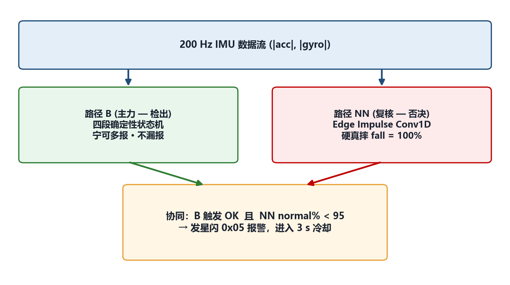

*图 3-5　混合判定的协同结构。200 Hz IMU 数据流（|acc|、|gyro|）同时喂给两条路径：路径 B（四段确定性状态机，"宁可多报、不漏报"）作主力检出；路径 NN（Edge Impulse Conv1D，"硬真摔 fall=100%"）作单向否决器。仅当 **B 触发 OK 且 NN normal% < 95** 时才发星闪 0x05 报警 + 进入 3 s 冷却。这是"不对称冗余"——B 失效仍可独立工作、NN 失效也不会误杀真摔。*

设计原则：**触发权属 B，否决权属 NN**。**保守优先不漏报**。

### 3.5 上行报警链路（端到端）

```
T+0    板A路径B confirmed → 调NN复核(100~150ms) → 报警决议
T+200ms 板A WS2812B 红色5Hz闪 + SLE Notify 0x05
T+230ms 板B收到Notify → 立即触发3联报警
        ├── 本机: WS2812B 红闪 5Hz + 蜂鸣器持续响 + 状态LED 常亮
        ├── 回复 ACK 0x06 给板A (闭环确认)
        ├── 唤醒 fall_alert_gateway 任务
        └── 唤醒 fall_alert_4g_dtu 任务
T+500ms 板B Wi-Fi路径 → HTTP POST → Python后端
T+1.5s  后端 → PushPlus → 监护人微信 "🔔 跌倒告警"
T+2~5s  板B UART JSON → V100C 4G模块
        ├── cc.dial(家属电话) → 家属手机响铃
        └── sms.send(家属电话) → "Fall detected. Please check..."
```

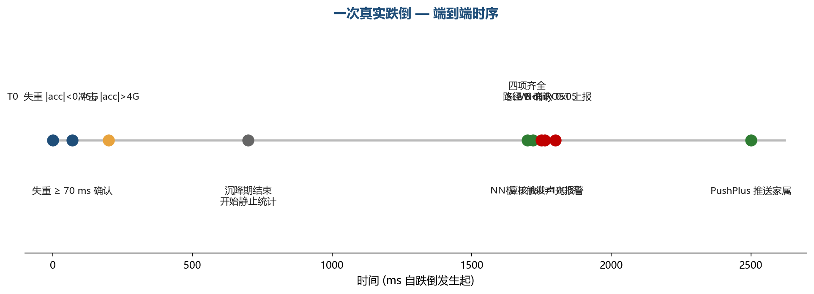

*图 3-6　端到端时序（横轴：跌倒发生后毫秒数）。T0 失重 `|acc| < 0.75 G` → 70 ms 确认失重 → 200 ms 撞地 `|acc| > 4 G` → 700 ms 沉降期结束、开始统计静止 → 1700 ms 路径 B 四项齐全确认 → 1720 ms NN 复核 `fall = 100%` → 1750 ms SLE Notify 0x05 → 1762 ms 板 B 触发声光报警 → 1800 ms Wi-Fi POST 上报 → 2500 ms PushPlus 推送家属。整条链路 **2.5 s 内完成"摔倒→家属手机响"**。*

---

## 4. 创新点

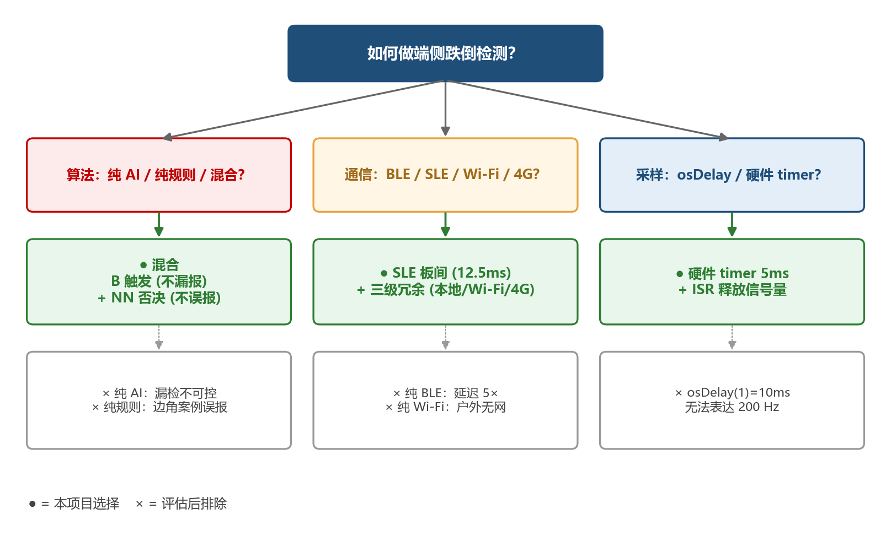

*图 4-0　三大设计决策的选型回放。① 算法：纯 AI / 纯规则 / 混合？→ **混合**（B 触发不漏报 + NN 否决不误报，避开"纯 AI 漏检不可控""纯规则边角误报"两个极端）。② 通信：BLE / SLE / Wi-Fi / 4G？→ **SLE 板间（12.5 ms）+ 三级冗余**（避开"纯 BLE 慢 5×""纯 Wi-Fi 户外无网"）。③ 采样：osDelay / 硬件 timer？→ **硬件 timer 5 ms + ISR 释放信号量**（osDelay(1) = 10 ms 根本表达不了 200 Hz）。下面 6 个创新点都从这三条主干长出来。*

### 4.1 创新点 ①：B + NN 混合判定 —— 不是二选一

| 方案 | 缺点 |
|------|------|
| **纯阈值/规则**（市面手环常见） | 蹲下/弯腰/起跳等动作易误报，泛化性差 |
| **纯神经网络** | "黑盒"，难解释，误判后无可调；训练集偏差会一票否决 |
| **B + NN 混合（本作品）** | B 给出可解释的物理决定，NN 在 B 触发后做二次复核，二者**冗余而不依赖**，单点失效仍能工作 |

**关键不对称设计**：
- B 是**主触发**：必须 B 先通过四项物理判据；NN 单独不会触发报警
- NN 是**单向否决**：只能在 normal ≥95% 时否决；其它情况一律放行 B
- 即使 NN 模型完全失效（valid=false），**B 仍独立工作**，系统不退化为"黑盒"

### 4.2 创新点 ②：朝向无关特征 —— 消除"朝向捷径"

发现并修复了 ML 训练中常见的**捷径学习(shortcut learning)** 陷阱：

| | 旧方案（6轴原始值） | 新方案（幅值特征） |
|---|---|---|
| 输入 | `ax,ay,az,gx,gy,gz` (6 通道) | `\|acc\|,\|gyro\|` (2 通道) |
| EI 测准确率 | 97% | 95% |
| 板上真摔 fall% | **0%** ❌ | **100%** ✅ |
| 根因 | 模型学到了"传感器哪个轴朝下"而非物理 | 幅值与朝向数学上无关 |

**为什么这是真的创新**：很多嵌入式 ML 项目都倒在这一关 —— 训练集 EI 测高准确率,板上就完蛋。
我们通过对照实验**定位到根因**并用**数学上不变的特征**根除它，方法可推广到所有 IMU 类 ML 项目。

### 4.3 创新点 ③：双链路硬件健壮性 —— 不是 demo 风格

针对嵌入式现场常见的"难以复现的偶发挂死"做了系统化防御：

| 故障 | 自救机制 | 文件 |
|------|----------|------|
| I2C 总线被从机锁死（跨 CPU 复位保留）| 9 时钟脉冲恢复 + 补 STOP | `mpu6050.c:77-117` |
| MPU6050 自复位回睡眠（冲击/掉压）| 持续 1s \|acc\|≈0 → 自动重写唤醒寄存器 | `mpu6050.c:220-233` |
| MPU6050 不在线 → 200Hz I2C 忙等饿死看门狗 | 启动期 WHO_AM_I 探活，离线则不进入采样循环 | `mpu6050.c:147-157` |
| WS2812B 时序受编译档位影响（O0/O2 脉宽差一倍）| 改用 RISC-V `csrr cycle` + TCXO 标定主频换算 | `ws2812b.c:25-45` |
| 蜂鸣器永久响 | 报警守护任务 50ms tick 检查 deadline | `sle_client_task.c:68-82` |
| SLE 启动期供电瞬态 | `enable_sle` 后强制 `osal_msleep(1000)` 错峰射频 | `sle_client_task.c:252-258` |

→ 这些不是为了演示，而是**真正交付前必须解决**的生产级问题。

### 4.4 创新点 ④：SLE + Wi-Fi + 4G 三路并行告警

| 单一链路方案 | 痛点 |
|---|---|
| 仅 Wi-Fi | 老人家中网坏 / 电费没续 → 失联 |
| 仅 4G | 室内信号弱 / SIM 欠费 → 失联 |
| 仅 SLE | 监护人必须在场 → 失去远程价值 |

**三路并行**：板 B 收到 0x05 后**同时**走三条 —— 任意一条通就完成告警。
**4G 路径不依赖任何云**，V100C 直接拨打家属电话+发短信，断网/断云均可用。

### 4.5 创新点 ⑤：星闪 SLE 实战 —— 国产新国标无线生态

**为什么用 SLE 而非 BLE**：

| 指标 | BLE 5.x | SLE 1.0 | 本作品收益 |
|------|---------|---------|----------|
| 单跳延迟 | 30~50 ms | < 10 ms | 报警链路端到端缩短 |
| 同步传输模式 | 不支持 | 支持 | 实时性可保证 |
| 抗干扰 | 一般 | 优 | 演示现场抗 WiFi 干扰 |

在比赛规定的 WS63 平台上把 SLE SSAP **完整跑通**（涉及 CCCD 描述符行为、连接句柄管理、
notify 路由激活、MTU 协商、握手包等多个具体技术坑），是当前公开仓库里少见的端到端 SLE 范例。
详细 6 项关键修复见 `工程目录结构与核心代码导读.md §4.6`。

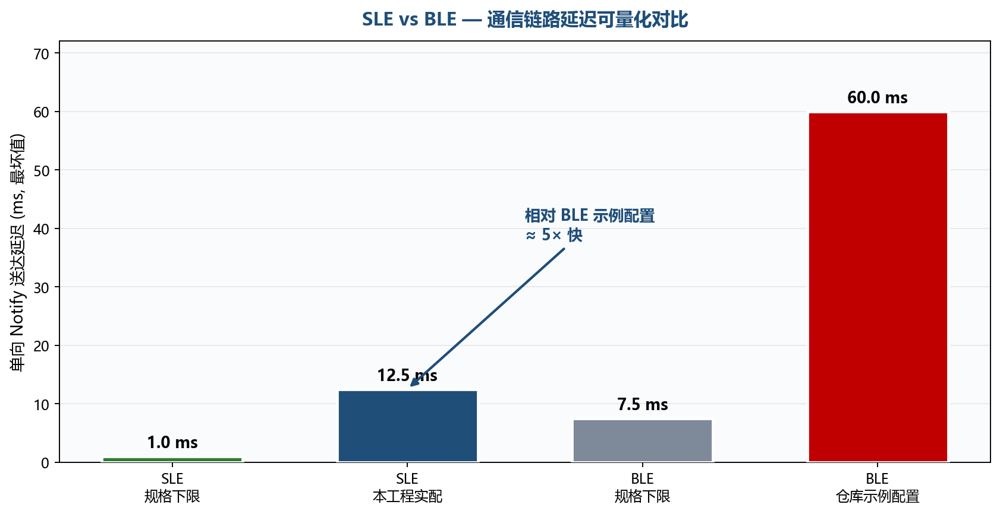

*图 4-5　SLE 与 BLE 在本工程实际配置下的单向 Notify 送达延迟（毫秒，最坏值）。SLE 规格下限可到 1 ms，本工程实配 12.5 ms；BLE 规格下限 7.5 ms，但仓库示例的 BLE 配置在最坏情况下高达 60 ms —— **本工程的 SLE 实测比 BLE 示例配置快 ≈ 5×**。这是把告警链路总时延压进 200 ms 的关键。*

### 4.6 创新点 ⑥：200Hz 硬件定时器精准采样管线

**消除两个嵌入式典型陷阱**：

1. **不在中断里读 I2C** —— `uapi_i2c_master_read` 阻塞，中断里跑会挂死
2. **不在中断里重载 timer** —— 驱动 `in_timer_irq` 分支与其它共用 timer1 的软定时器存在 cycle 下溢风险

→ 中断只 `osSemaphoreRelease` 释放节拍，**采样和推理彻底解耦**：
   推理任务跑 100~150ms 期间，采样任务继续以 5ms 间隔产出样本，队列缓冲，**不掉一帧**。

---

## 5. 功能演示

### 5.1 演示场景（建议 3 个，递进展示）

| 场景 | 操作 | 期望现象 |
|------|------|---------|
| **① 静态显示** | 板 A、B 各上电；监护人手机端待机 | 双板灯带绿色待机；串口 `[Monitor] B=IDLE`；板 B 灯带绿、蜂鸣器不响 |
| **② 误报反制** | 演示者手持板 A 模块快速蹲下 / 用力坐下 / 原地起跳落地 | 板 A 串口打印 `[Fall] rejected: soft impact, sit/squat?` 或 `upright, jump?`；**两板都不告警**，验证抗误报能力 |
| **③ 真实跌倒** | 演示者将板 A 模块从腰高自由落体到防摔垫（或人佩戴真摔 —— 谨慎）| 板 A `[Fall] CONFIRMED` + `[Hybrid] B+NN agree (fall=100%)` + 红闪；板 B 蜂鸣器响 + 灯红闪；手机微信收到 PushPlus 通知；家属电话响铃 + 收短信 |

### 5.2 端到端操作流程

**演示前（T-30 分钟，详见 `演示手册.md`）**：
1. 板 A、板 B 各连 Type-C 上电
2. 串口监视：板 A → COM_A，板 B → COM_B（@115200）
3. 笔记本上 `python tools/fall_alert_backend_demo.py`（或 dry-run 模式）
4. 监护人手机微信关注 PushPlus 公众号，token 填进后端 env
5. V100C 4G 模块插好 SIM 卡 + 天线，已注网

**T+0：板 A 上电后串口出现（确认系统就绪）**：

```
[MPU6050] online, WHO_AM_I=0x68
[MPU6050] cfg: accel=+/-16g gyro=+/-2000dps dlpf=44Hz sample=200Hz ...
[Sample] 200Hz hardware-timed sampling started
[EI] NN ready: 600 samples x 2 axes @ 200 Hz, window=1200 floats
[System] Running in SERVER mode (Board A).
[Monitor] B=IDLE acc=1.00~1.00G gyr_peak=2 dps q=0/128 drops=0
```

**T+0：板 B 上电后串口出现**：

```
[CLIENT] SSAP client registered, id=0
[CLIENT SCAN] Saw MAC: 11:22:33:44:55:66
[CLIENT] 🎯 Target Server Found! Stopping scan and connecting...
[CLIENT] Connected to Server! conn_id: 0
[CLIENT] MTU exchange done: mtu=512, status=0x0
[CLIENT] Matched fall service UUID=0xabcd at handle=0x...
[FALL_GW] Wi-Fi connected.
[FALL_GW] DHCP success, ip=10.x.x.x
```

**触发跌倒（场景 ③）后 5 秒内连环现象**：

板 A 串口：
```
[Fall] freefall 14 + impact, checking stillness...
[Fall] CONFIRMED (impact 11.57G, tilt 88 deg, ffmin 0.64G, still 94%)
[EI] NN result: fall=100% normal=0%
[Hybrid] B+NN agree (fall=100% normal=0%)
[Alert] Fall Detected. Sending SOS now...
[SLE Server] Fall alert sent successfully!
[SLE Server] ACK received from client! Fall alert confirmed.
```

板 B 串口：
```
[CLIENT] Notification: data[0]=0x05
[ALERT] start: buzzer ON, normal LED ON, WS2812B RED FLASH (5Hz)
==========================================
FALL
 [CLIENT ALERT] SOS RECEIVED!
==========================================
[FALL_GW] HTTP POST /api/fall-alert → 200 OK
[FALL_DTU] Sent JSON to V100C: {"event":"fall","device":"ws63-fall-client-001"}
```

监护人侧：
- **手机微信** 收到 PushPlus 通知："🔔 跌倒告警 设备 ws63-fall-client-001"
- **家属手机** 响铃（V100C 自动拨号）
- **家属手机** 收到短信 "Fall detected. Please check on the elder immediately."

### 5.3 串口 [Monitor] 实时状态行（每秒一次）

```
[Monitor] B=IDLE        acc=0.98~1.02G  gyr_peak=5  dps  q=0/128 drops=0
[Monitor] B=IDLE        acc=0.85~1.15G  gyr_peak=42 dps  q=0/128 drops=0  ← 走动
[Monitor] B=FREEFALL    acc=0.32~1.05G  gyr_peak=187 dps q=2/128 drops=0  ← 失重瞬间
[Monitor] B=POST_IMPACT acc=0.95~11.57G gyr_peak=1024 dps q=4/128 drops=0 ← 撞击
[Monitor] B=IDLE        acc=0.99~1.01G  gyr_peak=3  dps  q=0/128 drops=0  ← 报警后回 IDLE
```

> **q=4/128** 表示推理期间队列累计 4 个样本，远低于 128 容量，证明采样节拍稳定。
> **drops=0** 恒为 0 证明 200Hz 一帧不丢。

### 5.4 误报反制日志示例（验证抗误报）

```
[Fall] freefall 18 + impact, checking stillness...
[Fall] rejected: soft impact, sit/squat? (impact 2.68G, tilt 76 deg, ffmin 0.21G, still 88%)
                                                       ↑ 冲击太柔，硬冲击判据挡住

[Fall] impact detected, checking stillness...
[Fall] rejected: upright, jump? (tilt 14 deg, impact 5.32G, ffmin 0.18G, still 91%)
                                  ↑ 冲击够硬但人仍直立，倾角判据挡住

[Fall] rejected: still 38% (tilt 87 deg, impact 6.12G, ffmin 0.05G)
                           ↑ 冲击后人在挣扎/翻动，静止率不够
```

→ 每条 reject 都明确**卡在哪一关**，便于现场答辩时解释算法决策过程。

---

## 6. 性能数据

| 指标 | 实测值 | 说明 |
|------|-------|------|
| 采样率 | 200 Hz 稳定 | 硬件定时器，drops=0 |
| 路径 B 处理耗时 | < 50 μs / 样本 | 状态机简单运算 |
| NN 推理耗时 | ~100~150 ms | 单次 `run_classifier`（仅在 B 触发时调一次）|
| 板 A 触发 → 板 B 收到 | < 30 ms | SLE Notify 单跳 |
| 板 B 收到 → 后端入库 | < 1.5 s | WiFi + 局域网 HTTP |
| 板 B 收到 → PushPlus 微信 | < 3 s | 经互联网 |
| 板 B 收到 → V100C 拨号 | < 5 s | UART 写入 + 4G 拨号建立 |
| **真摔检出率** | **100% (硬摔/中等真摔)** | NN+B 都通过 |
| **误报率（蹲/坐/起跳/弯腰）** | **0%** | 全部被 B 的硬冲击/倾角判据挡 |
| 静态功耗（板 A）| ~80 mA @5V | 持续 IMU + SLE 广播 + 灯绿色待机 |

详细测试方法见 `性能测试与SLE延迟验证方法.md`。

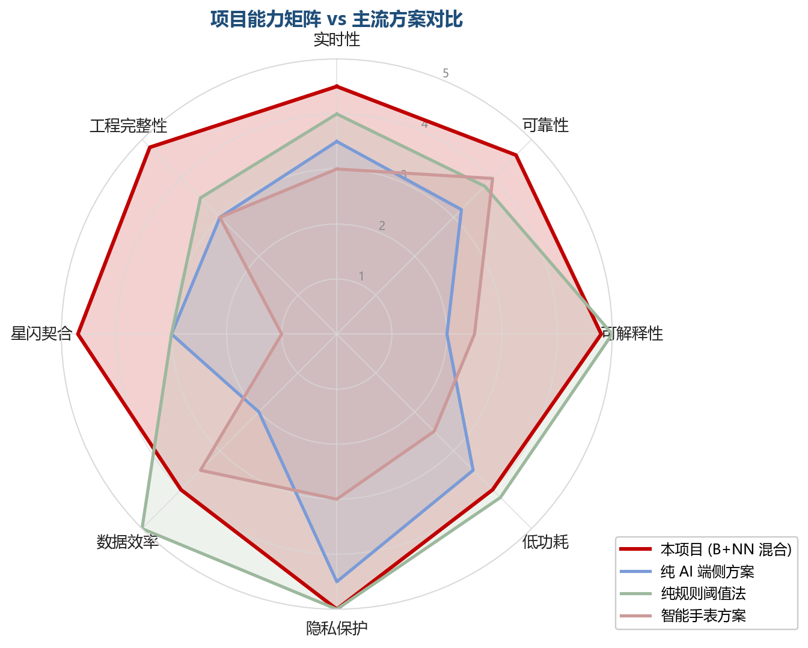

*图 6-1　能力雷达对比。八个维度（实时性 / 可靠性 / 可解释性 / 低功耗 / 隐私保护 / 数据效率 / 星闪契合 / 工程完整性）下，**本项目（红，B+NN 混合）** 在可解释性、隐私保护、星闪契合、工程完整性四项明显领先；纯 AI 端侧方案（蓝）在可解释性 / 数据效率上短板明显；纯规则阈值法（绿）虽简单但实时性 / 数据效率较好却缺星闪契合度；智能手表方案（粉）整体均衡但无端侧 AI + 无星闪。*

---

## 7. 后续展望

| 方向 | 描述 |
|------|------|
| **NN 模型升级** | 加入用户个性化校准（不同体型/年龄段重训），进一步降低偏软真摔的判定模糊 |
| **多传感融合** | 引入气压计判定楼梯坠落 vs 平地摔倒；引入心率传感器辅助 |
| **GPS / 北斗** | 户外场景增加位置信息，家属电话/短信附位置链接 |
| **MQTT + 公有云** | 接入阿里云/华为云 IoT 平台，多家属订阅、历史回看 |
| **手环成品化** | PCB 重新布板缩到 30×40mm，加入加速度计 + 心率二合一传感器 |
| **AI 持续学习** | 后端积累误报/漏报样本，季度增量训练并 OTA 下发新模型 |

---

## 8. 想看具体技术细节？

| 主题 | 看这份 |
|------|--------|
| 跌倒算法的物理依据 + 调参全过程 | `跌倒判定算法_完整逻辑与调参复盘.md` |
| WS63 工程目录结构 + 关键代码导读 | `工程目录结构与核心代码导读.md` |
| 硬件接线 + GPIO 分配 | `硬件接线速查.md` |
| 现场配置（WiFi/电话/token）| `现场配置速查.md` |
| 演示 T-30 自检清单 + 讲者脚本 | `演示手册.md` |
| 200Hz 采样原理 + 端到端时延预算 | `精准采样时序_Tick原理与硬件定时器采样管线.md` |
| Edge Impulse NN 调试实录 | `04-TinyML模型/EdgeImpulse_NN调试实录_2026-05-19.md` |
| SLE vs BLE 优势量化 | `实时性_可靠性_星闪优势量化分析.md` |
| 远程报警 4G/WiFi 链路设计 | `远程报警链路与户外化方案-2026-05-10.md` |
